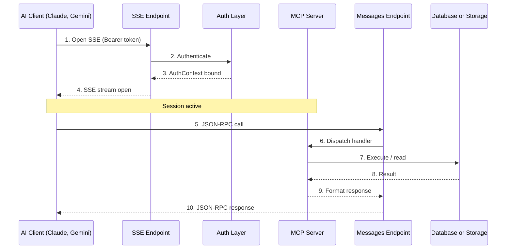

# NexusGate MCP Guide

MCP (Model Context Protocol) lets AI assistants like Claude, Gemini, and Copilot securely interact with your NexusGate databases and files through a standardized SSE-based interface.

---

## Table of Contents
1. [Quick Start](#1-quick-start)
2. [How It Works](#2-how-it-works)
3. [Configuration](#3-configuration)
4. [Available Tools](#4-available-tools)
5. [Available Resources](#5-available-resources)
6. [Security](#6-security)
7. [Client Setup Examples](#7-client-setup-examples)
8. [Performance](#8-performance)
9. [Troubleshooting](#9-troubleshooting)

---

## 1. Quick Start

```toml
# config.toml
[features]
mcp = true

[mcp]
server_name = "nexusgate"
server_version = "1.0.2"
max_result_rows = 50
max_directory_entries = 100
max_file_read_bytes = 1048576
```

Restart and connect:

```bash
# Using the MCP CLI (Python):
pip install mcp
mcp connect http://localhost:4500/api/v1/mcp/sse \
  --headers "Authorization: Bearer $(echo -n 'admin:YOUR_SECRET' | base64)"
```

Or configure Claude Desktop:

```json
// ~/.config/Claude/claude_desktop_config.json
{
  "mcpServers": {
    "nexusgate": {
      "command": "mcp",
      "args": ["connect", "http://your-server.com:4500/api/v1/mcp/sse"],
      "env": {
        "MCP_TOKEN": "<base64-admin-key:secret>"
      }
    }
  }
}
```

---

## 2. How It Works

MCP uses a **bidirectional SSE** (Server-Sent Events) transport:



### Step-by-Step

1. The client opens an SSE connection (`GET /sse`) with an API key
2. NexusGate authenticates the key via the same auth pipeline as REST (ban check, dynamic/static key lookup)
3. The `AuthContext` is stored in a per-session `ContextVar` — all subsequent tool calls inherit its permissions
4. The SSE stream stays open — the client sends JSON-RPC messages and receives responses over the same connection
5. Tool calls (`list_tables`, `query_database`, etc.) go through the same validation pipeline as REST API calls
6. All operations run with the API key's `mode`, `db_scope`, and `fs_scope`

**Key difference from REST API:** MCP sessions are stateful — the auth context is bound to the SSE connection, not per-request. This lets AI models maintain context across multiple tool calls without re-authenticating each time.

---

## 3. Configuration

```toml
[mcp]
server_name = "nexusgate"          # Server identity sent to AI clients
server_version = "1.0.3"           # Version advertised in initialization
max_result_rows = 50               # Max rows returned per query
max_directory_entries = 100        # Max files listed per directory
max_file_read_bytes = 1048576      # Max file read size (1 MB)
```

### Safety Caps

| Setting | Default | Why |
|---------|---------|-----|
| `max_result_rows` | 50 | Prevents large results from blowing the AI model's context window |
| `max_directory_entries` | 100 | Caps directory listings to avoid timeout on large folders |
| `max_file_read_bytes` | 1,048,576 (1 MB) | Limits memory per file read — files over this size return an error |

### Zero-Cost When Disabled

When `features.mcp = false`:
- **Zero imports** — the MCP router is lazy-imported inside a conditional
- **Zero routes** — no SSE or messages endpoints exist in the ASGI app
- **Zero memory** — no MCP classes instantiated, no registries populated
- **Zero CPU** — no background tasks or timers

---

## 4. Available Tools

### Database Tools

| Tool | Description | Parameters |
|------|-------------|------------|
| `list_databases` | Lists accessible database aliases | _(none)_ |
| `list_tables(database)` | Lists tables in a database with column previews | `database: str` |
| `describe_table(database, table)` | Full column definitions (types, PK, nullable) | `database: str`, `table: str` |
| `query_database(database, sql)` | Execute AST-validated SQL | `database: str`, `sql: str` |

**`query_database` security:**
- SQL is parsed by `sqlglot` AST parser — injection attempts are rejected before reaching the database
- Only the authenticated key's `mode` (readonly/readwrite/writeonly) and `db_scope` are enforced
- Queries are transpiled to the target engine's dialect automatically

### Storage Tools

| Tool | Description | Parameters |
|------|-------------|------------|
| `list_storages` | Lists accessible storage aliases | _(none)_ |
| `list_files(storage, path)` | Lists directory contents (capped at `max_directory_entries`) | `storage: str`, `path: str` (default: `/`) |
| `read_file(storage, path)` | Reads text file content (capped at `max_file_read_bytes`) | `storage: str`, `path: str` |

**`read_file` security:**
- Path traversal attacks are blocked by `os.path.realpath` canonical resolution
- Symlink swaps are detected via `O_NOFOLLOW` + `/proc/self/fd` verification (Linux)
- File reads are offloaded to a thread pool — event loop is never blocked
- All error messages are sanitized — no internal paths leaked

---

## 5. Available Resources

Resources provide structured context that AI models can read inline (without tool calls).

| Resource URI | Description |
|-------------|-------------|
| `nexusgate://db/{alias}/schema` | Full database schema (tables, columns, types, PKs) |
| `nexusgate://fs/{alias}/info` | Storage volume configuration and limits |

Resources respect the same auth scopes as tools — a key without access to a database cannot read its schema resource.

---

## 6. Security

### Auth Flow
```
Client → Bearer token → _authenticate_from_request()
  → Parse base64 token (key_name:secret)
  → _evaluate_network_bans()     — IP + key ban check
  → _get_dynamic_key_context()   — SQLite-backed key registry
  → _get_static_key_context()     — config.toml fallback
  → set_mcp_auth()               — binds to SSE session
```

### Protections

| Threat | Mitigation |
|--------|-----------|
| SQL injection | `sqlglot` AST parser rejects malformed/malicious SQL before execution |
| Path traversal | `os.path.realpath` canonical comparison blocks `../` escapes |
| Symlink TOCTOU | `O_NOFOLLOW` + post-open realpath verification (Linux) |
| File bomb | `max_file_read_bytes` cap — files over limit return error, not memory |
| Directory bomb | `max_directory_entries` cap — lists are truncated safely |
| Auth bypass | Same auth path as REST API — HMAC + SHA-256 |
| Session hijack | `ContextVar` scoped per async task, cleared in `finally` block |
| Enumeration | Generic "access denied" messages — no name leak on scope violations |
| Error leakage | All exceptions sanitized — no stack traces, no internal paths |
| Resource leak | `MCPServerManager.shutdown()` called during app teardown |
| Event loop blocking | All file I/O runs in `asyncio.to_thread()` — never blocks other requests |

### Rate Limiting
MCP requests go through the same `RateLimitMiddleware` as REST API calls. Configure via `config.toml`:

```toml
[rate_limit]
enabled = true
max_requests = 100
window = 60
```

Rate limits are per API key, not per connection.

---

## 7. Client Setup Examples

### Claude Desktop

```json
{
  "mcpServers": {
    "nexusgate": {
      "command": "mcp",
      "args": ["connect", "http://localhost:4500/api/v1/mcp/sse"],
      "env": {
        "MCP_TOKEN": "YWRtaW46W..."
      }
    }
  }
}
```

**Important:** The `MCP_TOKEN` environment variable is read by the MCP CLI and passed as the `Authorization` header. Generate it with:

```bash
echo -n "admin:your_secret_here" | base64
```

### Custom Python Client

```python
import asyncio
import httpx
from mcp import ClientSession
from mcp.client.sse import sse_client


async def main():
    token = "YWRtaW46W..."
    headers = {"Authorization": f"Bearer {token}"}

    async with sse_client(
        url="http://localhost:4500/api/v1/mcp/sse",
        headers=headers,
    ) as (read, write):
        async with ClientSession(read, write) as session:
            await session.initialize()

            # List databases
            result = await session.call_tool("list_databases", {})
            print(result.content[0].text)

            # Query a database
            result = await session.call_tool(
                "query_database",
                {"database": "main_db", "sql": "SELECT * FROM users LIMIT 5"},
            )
            print(result.content[0].text)


asyncio.run(main())
```

### cURL (for testing)

```bash
# Step 1: Get an SSE session ID
# (Most MCP SDKs handle this automatically)

# Step 2: Send a tools/list request via POST
curl -X POST "http://localhost:4500/api/v1/mcp/messages" \
  -H "Authorization: Bearer YWRtaW46W..." \
  -H "Content-Type: application/json" \
  -d '{"jsonrpc": "2.0", "id": 1, "method": "tools/list"}'
```

---

## 8. Performance

### Resource Profile

| Scenario | Memory | CPU | Event Loop Blocking |
|----------|--------|-----|---------------------|
| MCP disabled (idle) | **0 KB** | **0%** | None |
| MCP connected (idle) | ~100 KB | 0% | None |
| Query database (1 row) | ~10 KB | ~1ms | **0ms** (async) |
| List tables (50 tables) | ~50 KB | ~5ms | **0ms** (async) |
| Read file (1 MB) | ~1 MB | ~2ms | **0ms** (thread pool) |
| List directory (100 entries) | ~20 KB | ~1ms | **0ms** (thread pool) |

### Connection Handling

- Each SSE connection is an async task — lightweight (~8 KB overhead)
- No background threads, no polling, no timers
- Connections are cleaned up on disconnect (SDK handles this)
- All file I/O uses `asyncio.to_thread()` — the event loop remains responsive under load

---

## 9. Troubleshooting

### "MCP_AUTH_FAILED"

The API key is invalid, expired, or the token format is wrong.

```
Fix: Ensure the Authorization header is:
  Authorization: Bearer <base64("key_name:secret")>
  
Generate with: echo -n "admin:your_secret" | base64
```

### "Access denied: the requested resource is not available"

The API key exists but does not have permission for that database or storage.

```
Fix: Check the key's db_scope or fs_scope in config.toml or SecurityStorage.
  api_key.admin.db_scope = ["*"]      # Allow all databases
  api_key.admin.fs_scope = ["*"]      # Allow all storages
```

### "File too large"

The file exceeds `max_file_read_bytes` (default 1 MB).

```
Fix: Increase the limit in config.toml:
  [mcp]
  max_file_read_bytes = 5242880  # 5 MB
```

### SSE connection drops

Network timeouts or proxy configuration issues.

```
Fix: Ensure reverse proxy (LiteSpeed/NGINX) has adequate timeout settings:
  proxy_read_timeout 300s;
  proxy_send_timeout 300s;
```

### "Tool 'X' encountered an error"

An internal error occurred during tool execution. The error is sanitized — no stack traces are leaked to the client.

```
Fix: Check the NexusGate server logs for the full error details.
```
